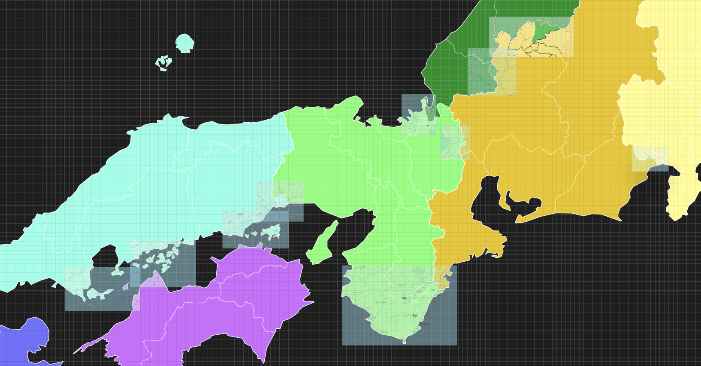

# japan-electrical-region-maps

Maps of the Japan Electrical Grid Regions

> The best map I have currently!

## Background

The electrical transmission network in Japan is made up of 10 area [WIKI](https://en.wikipedia.org/wiki/Electricity_sector_in_Japan) each of which broadly combine a couple of Japan's 47 prefectures to make a transmission region.  
The problem is, the regions don't perfectly line up with the prefecture boundaries in a number of instances - which means that simply using a prefecture SVG of Japan and merging a couple sections doesn't really give you an accurate picture.  
Having an accurate picture can be important, as each grid region functions broadly independantly with their own electricity market and flexibility systems. For example, if you were to build a factory, the site you choose would then choose your grid region which would affect the price you pay, the level of green energy in your energy mix, and the flexibility programs you would have access to.  
So, for my other project [Denki Carbon](denkicarbon.jp), I decided to `Make Japanese Grid Region Maps Great Again™` and build some nice maps.

Part of the challenge of this has been the use of source maps to get me started, but then those maps have their own problems, such as maybe being a bit inaccurate on the prefecture boundaries or missing out islands I need to attribute to one region or another. But I've learnt a good amount about GIS software, so that was fun.

Anyway, I wanted to share these maps with other folk, for free, to use as you please for your own projects and companies. I'll try and make the licenses as permissive as possible, in other words, comercial uses are totally ok with me!

### Ok, but, where are the deviations? How do you know where to draw the line?

I got all the specific information about the splits from a variety of Japanese wikipedia articles - [Starting from this top-level page](https://ja.wikipedia.org/wiki/%E4%B8%80%E8%88%AC%E9%80%81%E9%85%8D%E9%9B%BB%E4%BA%8B%E6%A5%AD%E8%80%85).  
And, as I count it there are actually only a few meaningful differences, as follows in rough order of size:

- The East half of Shizuoka is within the TEPCO region instead of CHUDEN, the split happens along the Fuji river.
- The West End of Fukui Prefecuture is in the KEPCO region instead of HOKURIKU, going down the middle of the peninsula near Tsuruga along administrative boundaries.
- The South End of Mie Prefecture is in the KEPCO region instead of CHUDEN, encompassing a few administrative regions.
- Several islands in the Seto inland sea that ought to be in YONDEN (Shikoku), are actually in CHUGOKUDEN (the mainland), such as Shodoshima and most of the Shimanami Kaido.
- And finally, CHUDEN cedes a few administrative regions of Gifu to KEPCO and HOKURIKUDEN, including one that doesn't exist anymore...which was a challenge to map properly...

I've no idea how many supply points are in these areas, but there are numerous cities and factories in these regions that would certainly consume a decent amount of electricity.

> All the areas I'm aware of that I need to account for, the light colored boxes are reference clips from Google maps

## Format of the files

Each file set will be contained in its own folder, containing details about the source map and any inherited licenses.

## Suggestions and Changes

The maps in this repository are provided as-is, if you want to propose an update, please open an issue or PR to discuss.
